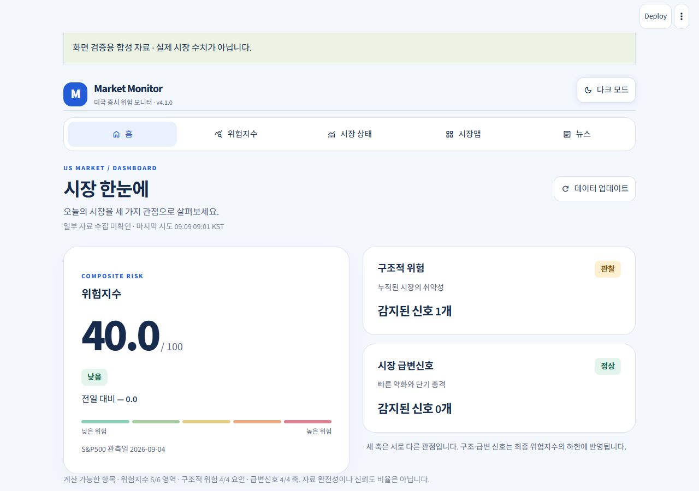

# 미국 증시 위험 모니터 v4.1.0

홈·위험지수·시장 상태·시장맵·뉴스를 새 정보 구조와 공통 디자인으로 개편했습니다.

- 홈: 대표 위험지수, 구조적 위험, 시장 급변신호와 주요 지표 행.
- 데스크톱 가로 탐색과 모바일 하단 탐색. 라이트·다크, 선택 유지, 화면 이동 시 상단·초점 복원.
- 위험 상세: 기본 점수·신호 하한·스트레스 하한의 형성 과정, 6개 구성요소, 감지 근거, 월별 추이.
- 시장 상태: 현재값·상태·근거·관측일을 지표별 행으로 비교.
- 시장맵: 타일과 검색 가능한 종목 목록. 뉴스: 카테고리와 제목 검색.
- 수집·정규화·계산·표시·세션 책임 분리. 금융 산식·가중치·임계값·공급원은 유지.

[개발 인수인계](DEVELOPMENT_v4.1.0.md) · [설계와 공식 지침 적용](DESIGN_v4.1.0.md) · [검증과 화면 비교](QA_v4.1.0.md) · [요구사항 추적](NEXT_VERSION_REQUIREMENTS.md)

## Windows 실행

Python 3.11 이상과 Streamlit 1.63 이상이 필요합니다.
ZIP을 전부 풀고 `install_windows.bat`, `start_windows.bat` 순서로 실행하세요.
소스 빌드이며 단독 EXE는 아닙니다.

```bash
python -m pip install -r requirements.txt
python -m streamlit run streamlit_app.py
```

## 검증 및 빌드

```bash
python -m unittest discover -s tests -v
python prepare_release.py
```

빌드 도구는 상위 폴더에 버전별 ZIP을 생성하고 SHA256SUMS.json으로 파일을 검증합니다.
가상환경·로컬 검증 캐시·비밀값·로그는 포함하지 않습니다.

## 알려진 한계

화면 검증은 합성 자료를 사용한 데스크톱 브라우저 기반입니다. 실제 휴대폰 하드웨어와 브라우저 200% 확대 전체 검증은 남아 있습니다.
CAPE/Breadth 공급원, 발표시점 정합성, 월간 자료 누락과 장기 금융 검증은 계속 추적합니다.
뉴스는 위험지수 및 시장 판정에 반영하지 않습니다. 자료 부족·지연은 정상 상태를 뜻하지 않습니다.
자동 테스트·GitHub 반영·서비스 적용과 사용자 디자인 수용은 각각 구분합니다.



이전 개발 기록: [v4.0.0-dev](DEVELOPMENT_v4.0.0-dev.md), [v3.50.0](개발_인수인계_v3.50.0.md)
